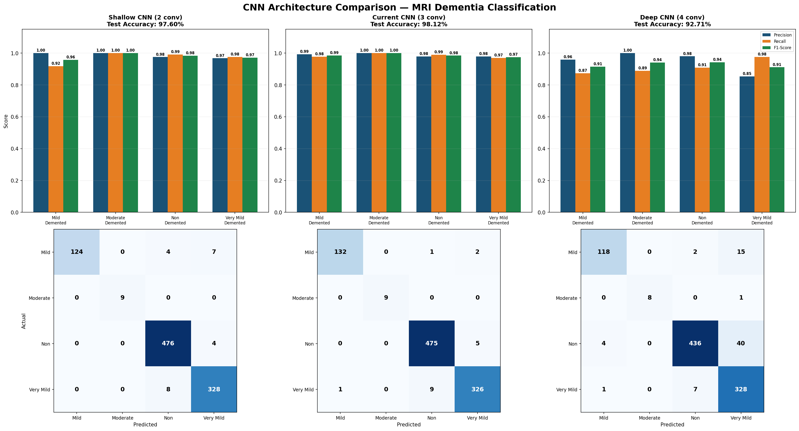
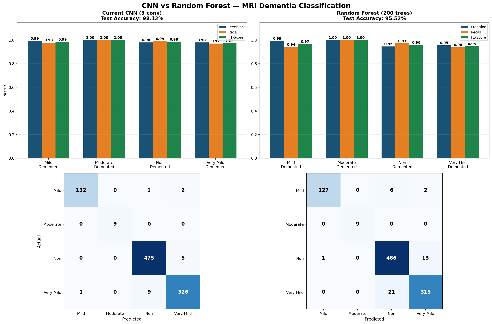
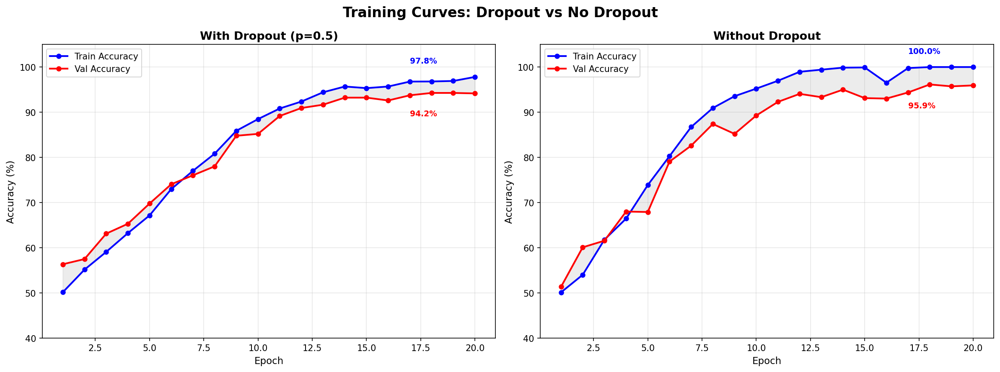

# MRI Alzheimer's Classifier

A multi-class classification system for detecting Alzheimer's disease progression from brain MRI scans. We compare Convolutional Neural Networks of varying depths against a from-scratch Random Forest to evaluate deep learning vs traditional ML approaches for medical image classification.

## Sample Outputs

### CNN Architecture Comparison



### CNN vs Random Forest



### Dropout Training Curves



## Dataset

- **Source:** [Kaggle Alzheimer's MRI Dataset](https://www.kaggle.com/datasets/tourist55/alzheimers-dataset-4-class-of-images)
- **Total Images:** 6,400
- **Classes:**

| Class              | Images | Percentage |
| ------------------ | ------ | ---------- |
| Non_Demented       | 3,200  | 50%        |
| Very_Mild_Demented | 2,240  | 35%        |
| Mild_Demented      | 896    | 14%        |
| Moderate_Demented  | 64     | 1%         |

- **Split:** 70% train (4,480) / 15% validation (960) / 15% test (960)

## Key Results

| Model                           | Test Accuracy |
| ------------------------------- | ------------- |
| Shallow CNN (2 conv layers)     | 97.60%        |
| **Current CNN (3 conv layers)** | **98.12%**    |
| Deep CNN (4 conv layers)        | 92.71%        |
| Random Forest (200 trees)       | 95.52%        |

Best model: **Current CNN (3 conv layers)** at 98.12% test accuracy.

## Directory Structure

mri-classifier/
├── data/ # MRI images organized by class
│ ├── Mild_Demented/
│ ├── Moderate_Demented/
│ ├── Non_Demented/
│ └── Very_Mild_Demented/
├── results/ # Saved models, metrics, and visualizations
├── src/
│ ├── preprocessing.py # Image loading, resizing, normalization
│ ├── data_loader.py # Dataset loading and train/val/test splitting
│ ├── model.py # CNN architecture (3 conv layers)
│ ├── train.py # Training script for main CNN
│ ├── evaluate.py # Evaluation metrics and classification report
│ ├── visualize.py # Visualization generation for main CNN
│ ├── model_comparison.py # Shallow vs Current vs Deep CNN comparison
│ ├── visualize_comparison.py # Comparison visualizations across CNN architectures
│ ├── dropout_comparison.py # With vs without dropout comparison + training curves
│ ├── augmentation_comparison.py # With vs without data augmentation comparison
│ ├── cnn_vs_rf_comparison.py # CNN vs Random Forest side-by-side comparison
│ └── rf/
│ ├── rf_model.py # Decision Tree + Random Forest
│ ├── rf_data_loader.py # Data loading for RF pipeline
│ ├── rf_train.py # RF training script
│ └── rf_evaluate.py # RF evaluation and visualizations
├── requirements.txt
└── README.md

## How to Run the Project

### Step 1: Clone the Repository

```bash
git clone https://github.com/RadiantBunny633/mri-classifier.git
cd mri-classifier
```

### Step 2: Install Dependencies

Make sure you have Python 3.8+ installed. Then install the required packages:

```bash
pip install -r requirements.txt
```

### Step 3: Set Up the Dataset

Download the [Alzheimer's MRI Dataset](https://www.kaggle.com/datasets/tourist55/alzheimers-dataset-4-class-of-images) from Kaggle and organize the images in the `data/` directory:
data/
├── Mild_Demented/
│ └── _.jpg
├── Moderate_Demented/
│ └── _.jpg
├── Non_Demented/
│ └── _.jpg
└── Very_Mild_Demented/
└── _.jpg

### Step 4: Train and Evaluate the CNN

Train the main 3-layer CNN:

```bash
python3 src/train.py
```

This trains for 20 epochs, saves the best model to `results/best_model.pth`, and outputs test accuracy. To see detailed evaluation metrics:

```bash
python3 src/evaluate.py
```

### Step 5: Run CNN Architecture Comparison

Compare Shallow (2 conv), Current (3 conv), and Deep (4 conv) CNNs:

```bash
python3 src/model_comparison.py
```

This trains all three architectures and saves each model and a comparison JSON to `results/`.

### Step 6: Run Dropout Comparison

Compare training dynamics with and without dropout regularization:

```bash
python3 src/dropout_comparison.py
```

Generates `results/dropout_training_curves.png` showing overfitting behavior and `results/dropout_comparison.png` with per-class metrics.

### Step 7: Train and Evaluate the Random Forest

Train the from-scratch Random Forest (note: this takes approximately 45-60 minutes on CPU due to pure Python/NumPy implementation with 200 trees on 16,384 features):

```bash
python3 src/rf/rf_train.py
```

Evaluate and generate RF visualizations:

```bash
python3 src/rf/rf_evaluate.py
```

### Step 8: Generate CNN vs RF Comparison

After both models are trained, generate the side-by-side comparison:

```bash
python3 src/cnn_vs_rf_comparison.py
```

### Step 9: Generate All CNN Visualizations

Generate per-class metrics and confusion matrices for all three CNN architectures:

```bash
python3 src/visualize_comparison.py
```

## Tools and Frameworks

- **Python 3.8+**
- **PyTorch** — CNN architecture, training, and evaluation
- **NumPy** — Data manipulation and from-scratch RF implementation
- **Matplotlib** — All visualizations and charts
- **Pillow** — Image loading and resizing
- **scikit-learn** — Data splitting and evaluation metrics only (no AI algorithms imported)

## Collaborators

1. Waasif Mahmood
2. Dharana Alilai
3. Amelie Kinsey
4. Zelen Gungor
